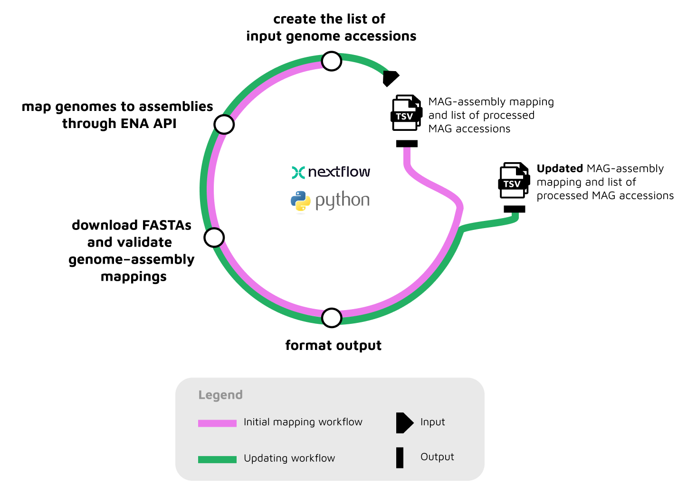

# MAG-to-Assembly Linking Pipeline

[](https://www.nextflow.io/)
[](https://docs.conda.io/en/latest/)
[](https://www.docker.com/)
[](https://sylabs.io/docs/)

## Introduction

This Nextflow pipeline is designed to map Metagenome-Assembled Genome (MAG) ENA accessions to their corresponding primary metagenome assemblies.
The pipeline retrieves metadata links through the [ENA Portal API and Browser API](https://ena-docs.readthedocs.io/en/latest/retrieval/programmatic-access.html), than verifies matches by comparing contig checksums between MAGs and assemblies.

## Pipeline Overview

{width=700px}

### Main workflow

The main workflow is shown in purple in the diagram and performs the following steps:

1. **Create the list of input genome accessions**

   Genome accessions are collected from MGnify catalogues and ENA, merged into a single list, deduplicated, and filtered to remove accessions that were processed in previous pipeline runs. If user-provided accessions are supplied, this step is skipped.

2. **Map genomes to assemblies**

   The ENA API is queried to retrieve metadata for each input genome accession. Using cross-references between genomes, samples, and assemblies in the ENA data model, the pipeline identifies candidate primary assembly accessions.

3. **Validate genome–assembly mappings using contig checksums**

   A genome–assembly pair is considered valid only if all contigs of the genome are present in the corresponding assembly. This is verified by comparing hash sets of contig sequences. FASTA files for both genomes and assemblies are downloaded in order to compute contig checksums.

4. **Format output files**

   All validated MAG–assembly mappings are merged into a single output table [`mag_to_assembly_mapping_*.tsv`](workflows/tests/data/mag_to_assembly_links.tsv), `Species_rep` column is added (MGnify genomes only), and [`processed_accessions_*.tsv`](workflows/tests/data/processed_accessions.tsv) file is created.

### Updating workflow

The pipeline can also be run in update mode (shown in green in the diagram).
In this mode, results from a previous execution are reused, and only MAGs submitted to ENA since the last run are processed. This allows the mapping table to be incrementally updated without reprocessing all accessions.

## Quick Start

1. Install [`Nextflow`](https://www.nextflow.io/docs/latest/getstarted.html#installation) (`>=23.04.0`)

2. Install any of [`Docker`](https://docs.docker.com/engine/installation/) or [`Singularity`](https://www.sylabs.io/guides/3.0/user-guide/) (you can follow [this tutorial](https://singularity-tutorial.github.io/01-installation/)). You can use [`Conda`](https://conda.io/miniconda.html) both to install Nextflow itself and also to manage software within pipelines. Please only use it within pipelines as a last resort; see [docs](https://nf-co.re/usage/configuration#basic-configuration-profiles).

3. Clone the repository:

   ```bash
   git clone https://github.com/EBI-Metagenomics/MAG-to-assembly-pipeline.git
   cd MAG-to-assembly-pipeline
   ```

4. Run the pipeline with test data on a MacOS machine using Docker containers:

   ```bash
   nextflow run main.nf \
     --input_accessions workflows/tests/data/input_accessions.tsv \
     --catalogues_metadata workflows/tests/data/all_catalog_metadata.tsv \
     --merge_with_results workflows/tests/data/mag_to_assembly_links.tsv \
     -profile docker,test,arm
   ```

## Usage

Main workflow of the pipeline runs without any user-provided input and automatically processes all MAG/bin accessions retrieved from ENA and MGnify.

### Optional Input Parameters

- `--accessions_list`: Path to TSV file containing input genome accessions (one per line). When provided, the pipeline processes only these accessions instead of collecting them automatically from ENA.
- `--catalogues_metadata`: Path to TSV file containing genome metadata from MGnify catalogues. Only used if provided with `--accessions_list`.
- `--merge_with_results`: Path to an existing genome–assembly mapping file to be merged with newly generated results (see [example](workflows/tests/data/mag_to_assembly_links.tsv)).
- `--skip_accessions`: Path to TSV file containing genome accessions (one per line) that were processed in previous runs and should be excluded. This option is not applicable when `--accessions_list` is used.

### Optional Output Parameters

- `--output_path`: Output directory where results will be written (default: `./results`)

### Optional Execution Parameters

- `--batch_size`: Size of batches into which the list of input accessions is divided for parallel processing (default: `250`)
- `--debug`: Enable debug mode to produce additional logging information (default: `false`)
- `--cleanup`: Remove cached contig checksum files after execution to reduce disk usage (default: `true`)

### Usage scenarios

#### Run without any input files (process all ENA/MGnify accessions)

```bash
nextflow run main.nf -profile docker
```

#### Run with custom accession list

```bash
nextflow run main.nf \
  --accessions_list input_accessions.tsv \
  --catalogues_metadata metadata.tsv \
  --output_path results \
  -profile docker
```

#### Update an existing mapping with newly submitted MAGs

```bash
nextflow run main.nf \
  --merge_with_results previous_mapping.tsv \
  --skip_accessions processed_accessions.tsv \
  -profile docker
```

#### Generate mag*to_assembly_links_to_unlink*\* file

```bash
nextflow run main.nf \
  --merge_with_results previous_mapping.tsv \
  -profile docker
```

## Output

The pipeline generates the following outputs in the specified output directory:

- `processed_accessions_YYYY-MM-DD_HHhMMm.tsv`: Timestamped list of genome accessions processed during the run
- `mag_to_assembly_mapping_YYYY-MM-DD_HHhMMm.tsv`: Timestamped table mapping genomes to their corresponding assemblies
- `mag_to_assembly_links_to_unlink_YYYY-MM-DD_HHhMMm.tsv`: Genome–assembly pairs that should be removed from downstream databases, typically due to suppression in ENA (generated only when `--merge_with_results` is used without `--skip_accessions`).
- `ena_related_errors/*.err`: Error logs listing genomes that failed processing due to ENA-related issues.

## Configuration Profiles

The pipeline comes with several configuration profiles:

- `local`: For running on local machines with limited resources
- `test`: For running in the test mode
- `arm`: For running on MacOS machines
- `codon_slurm`: For running on SLURM clusters (specifically configured for Codon)
- `docker`: For running with Docker containers
- `singularity`: For running with Singularity containers
